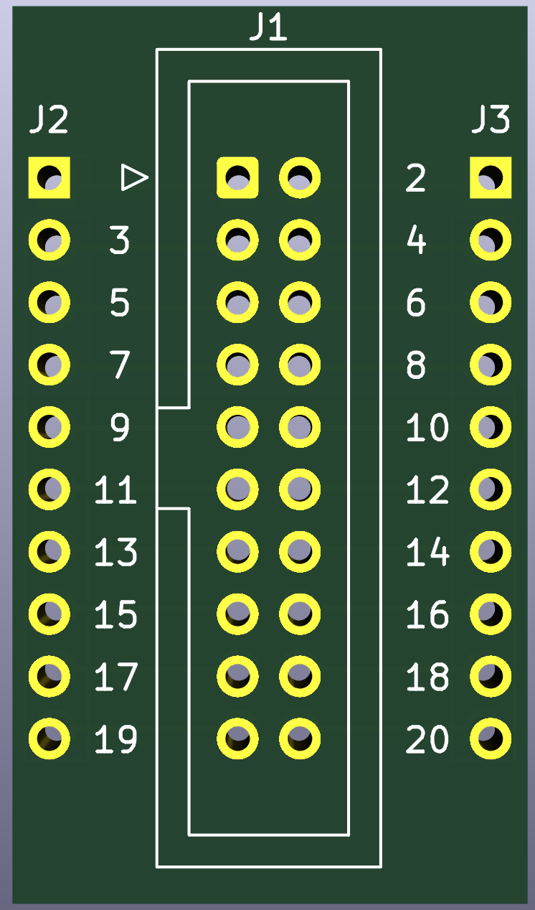

# BreakoutAdapter

For some use cases, I need to build BreakoutAdapters for setup and testing. I decided to publish this stuff here. Maybe you have similar use cases or need for some other stuff. The projects are independently and build with KiCad 7 (mostly, some are build with KiCad 8). If you don't know KiCad please refer to <https://www.kicad.org/>.

In addition to that, I published the boards at PCBWay Shared Projects.

## Header Breakout

The boards are follwing the same principle.

### 20 pin

I did some changes on the board layout and the labeling.

### 26 pin

PCBWay Project: <https://www.pcbway.com/project/shareproject/Header_Breakout_Adapter_26_pin_d59d37f2.html>

### 34 pin

PCBWay Project: <https://www.pcbway.com/project/shareproject/Header_Breakout_Adapter_34_pin_f59a8096.html>

